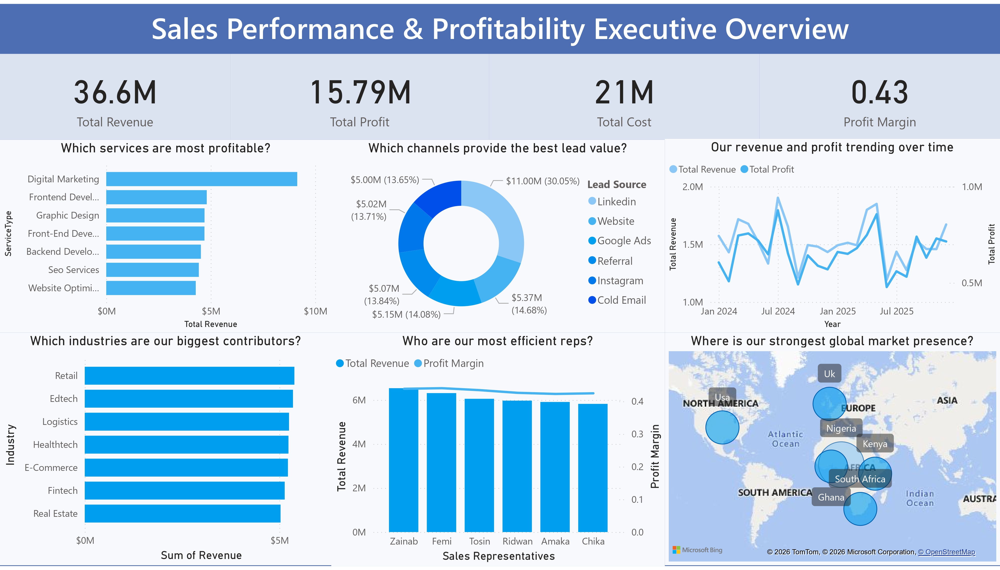

# 📊 SpaceTT Sales Performance Analysis (2024–2025)

## 🔍 Project Overview

This project analyzes sales performance data for SpaceTT Solutions using Power BI.

The objective was to clean messy transactional data and build an executive dashboard that answers key business questions about revenue, profitability, and sales performance.

---

## 📊 Dashboard Preview

---

## 🧹 Data Cleaning Process

- Removed null revenue records
- Standardized inconsistent service naming
- Fixed currency formatting issues
- Created Profit column (Revenue - Cost)
- Removed duplicate Transaction IDs
- Added Year, Month, Quarter columns

---

## 📈 Business Questions Answered

1. Which service generates the highest revenue?
2. Which lead source drives high-ticket deals?
3. Which region contributes the most profit?
4. Is 2025 outperforming 2024?
5. Which sales rep closes the most profitable deals?

---

## 🛠 Tools Used

- Power BI
- Power Query
- DAX
- Excel

---

## 💡 Skills Demonstrated

- Data Cleaning
- Data Modeling
- KPI Development
- Dashboard Design
- Business Insight Generation
